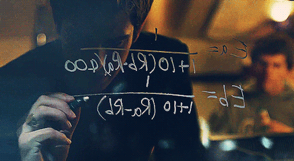

# babe-mash  

 

I was intrigued by the scene in the movie Social Network in which Eduardo Saverin, then a friend of Facebook founder Mark Zuckerberg, writes an Elo rating algorithm on the window of a Havard dorm.  

  

Zuckerberg created <a href="https://en.wikipedia.org/wiki/History_of_Facebook">FaceMash</a>. The website was set up as a type of "hot or not" game for Harvard students, which placed two pictures side-by-side and thus let the user decide who was hot or not.    

   

The algorithm in the film is actually incorrect - it should be:  
Ea = 1/(1+10((Rb-Ra)/400))   
Eb = 1/(1+10((Ra-Rb)/400))  

Therefore, I decided to implement this algorithm, though, for ethical reasons, I didn't want to copy Zuckerberg's choice of subject - he uploaded photos of fellow students. Instead, I have used photos of popular swimwear/lingerie models.    
  
Here is my ealier JavaScript code for FaceMash: <a href="https://github.com/k1n4kut4/facesmash">https://github.com/k1n4kut4/facesmash</a>   